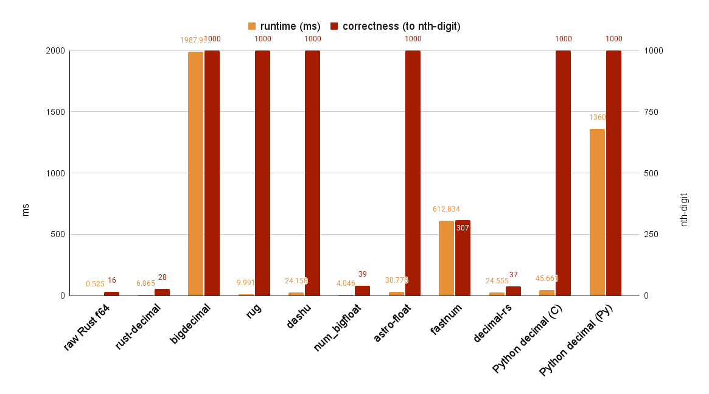

# Rust Big Number Benchmark

This project is to compare different Rust big number crates in views of performance and precision.

The scenario used for testing is to calculate Pi to a thousand digits as close as possible. Algorithm leveraged to calculate Pi is [Bailey–Borwein–Plouffe formula (BBP)](https://en.wikipedia.org/wiki/Bailey%E2%80%93Borwein%E2%80%93Plouffe_formula).

## Big Number Crates

Here compares the following Rust crates that are designed to deal with big numbers:

| Crate | Sig. Figs. | Precision Type | Note |
| --- | --- | --- | --- |
| [bigdecimal](https://github.com/akubera/bigdecimal-rs) | arbitrary | decimal | Pure Rust. Need to set precision at compile time (see [ref](https://github.com/akubera/bigdecimal-rs?tab=readme-ov-file#compile-time-configuration)) |
| [rug](https://gitlab.com/tspiteri/rug) | arbitrary | binary | Depends on external GNU library |
| [rust-decimal](https://github.com/paupino/rust-decimal) | 28 | binary | Pure Rust |
| [dashu](https://github.com/cmpute/dashu) | arbitrary | decimal | Pure Rust. |
| [num-bigfloat](https://github.com/stencillogic/num-bigfloat) | 39 | binary | Pure Rust. Tricky to use (see [appendix](#careful-about-using-num_bigfloat)). |
| [astro-float](https://github.com/stencillogic/astro-float) | arbitrary | binary | Pure Rust. Extra efforts to use (see [appendix](#lack-supports-of-direct-arithmetic-manipulation)) |
| [fastnum](https://github.com/neogenie/fastnum) | 307 | binary | Pure Rust |
| [decimal-rs](https://github.com/yashan-technologies/decimal-rs) | 37 | binary | Pure Rust |

A raw Rust f64 version and also two Python versions using `decimal` are implemented to compare with these crates. 

## Experiment Setup

- All significant figures are set to 1,000 digits in decimal (if possible). For those precision refers to binary format, additional precision number converstion is calculated (multiplied with a constant log10 value).
- Iteration of Pi calculation is set to 1,000.
- There are two implementation types of Python `decimal` package, which are C and pure Python. Both results are provided (notice that the normal importing will use the C version).
- [hyperfine](https://github.com/sharkdp/hyperfine) is used for running the experiments.

## Correctness

Since not all approach supports arbitrary float number precision, an additional metric is listed to show how precise the Pi can be represented in terms of digits.

## Environment

- OS: Ubuntu 20.04
- CPU: Intel(R) Core(TM) i7-10700 CPU @ 2.90GHz
- RAM: 16GB
- Rust Version: 1.86.0
- Cargo Version: 1.86.0
- Python Version: 3.13.4

## Results

The results are as the following table:

| Approach | Runtime [ms] | Relative | Correctness (to nth digit)|
|:---|---:|---:|---:|
| raw Rust f64 | 0.525 ± 0.047 | 1.00 | 16 |
| `rust-decimal` | 6.865 ± 0.312 | 13.08 ± 1.32 | 28 |
| `bigdecimal` | 1987.993 ± 23.475 | 3786.60 ± 342.69 | 1000 |
| `rug` | 9.991 ± 0.377 | 19.03 ± 1.85 | 1000 |
| `dashu` | 24.158 ± 1.364 | 46.01 ± 4.88 | 1000 |
| `num_bigfloat` | 4.046 ± 0.21 | 7.71 ± 0.80 | 39 |
| `astro-float` | 30.776 ± 0.371 | 58.62 ± 5.31 | 1000 |
| `fastnum` | 612.834 ± 11.129 | 1145.51 ± 152.79 | 307 |
| `decimal-rs` | 24.555 ± 0.456 | 45.90 ± 6.12 | 37 |
| Python `decimal` (libmpdec) | 45.661 ± 2.27 | 86.97 ± 8.92 | 1000 |
| Python `decimal` (_pydecimal) | 1360 ± 17 | 2595.26 ± 209.71 | 1000 |



- The fastest one is the raw Rust f64 approach, but it has also the worst results in correctness, which is expected.
- The second and the third are `rust-decimal` and `num_bigfloat`, for which both use fix-length representation and thus the correctness are also limited.
- `decimal-rs` is much slower than the above two crates, which they all use fix-length of number representation.
- `fastnum` also uses a fixed-length representation, but it is significantly slower than all other approaches. This may be due to implicit cloning of shared objects, although it does offer higher precision than other fixed-length solutions.
- `rug` is the fastest among approaches that support arbitrary precision, though it depends on external GNU libraries. Note that the precision setting in the code refers to binary digits, so you need to manually convert the precision value to achieve the desired number of decimal digits.
- Both `dashu` and `astro-float` have roughly the same level of speed, for `dashu` is slightly faster over `astro-float`. But for the user experience, `astro-float` is much more lengthy to write compared to `dashu`. `astro-float` leverages a functional way for arithmetic operations. On the other hand, `dashu` could do it in a normal way of using arithmetic signs.
- Somewhat surprisingly, Python’s `decimal` outperforms the other three Rust crates, largely due to its underlying C implementation. When using the pure Python version, however, performance drops dramatically.
- Unexpectedly, `bigdecimal` has the worst performance, even compared to the pure Python `decimal` implementation. Its precision setting also differs from the other approaches, as it is determined at compile time. Although the documentation mentions that you can specify precision in code, doing so requires additional effort.

## Conclusion

Overall, if you are doing extremely precise floating-point calculation, `rug` is suggested. **DO** bare in mind to tune the digit of precision to your own needs.

The second recommended choice goes to `dashu`, for its effciency, precision, ease of use, and pure Rust support.


## Appendix

### Careful about using `num_bigfloat`

While calculating the Pi, using `num::bigfloat::from_u8(1)` to initialize inner varialbes might lead to incorrect results. To derive the correct results, it is required to use `num_bigfloat::ONE` and multiply it to get other integer numbers for the calculation. This behavior is weired. 

### Lack Supports of Direct Arithmetic Manipulation

When using `astro-float`, to do normal arithmetic calculation like add and multiply, you need to write it in a functional way with addtional arguments like following: 
```rust
use astro_float::{BigFloat, RoundingMode};

let prec = 1000;
let rm = RoundingMode::None;
let a = BigFloat::from_u8(2, prec);
let b = BigFloat::from_u8(3, prec);
let c = a.add(b, prec, rm);

// Following code does not compile
let c = a + b;
```

Or you have to use the `expr!` macro to accomplish it
```rust
use astro_float::ctx::Context;
use astro_float::{expr, Consts};

let mut ctx = Context::new(
    prec,
    rm,
    Consts::new().expect("constants cache initialized"),
    -10000,
    10000,
);

let c = expr!(a + b, ctx);
```
