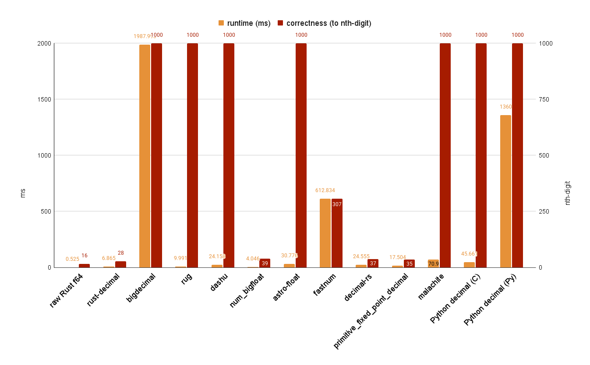

# Rust Big Number Benchmark

This project is to compare different Rust big number crates in views of performance and precision.

The scenario used for testing is to calculate Pi to a thousand digits as close as possible. Algorithm leveraged to calculate Pi is [Bailey–Borwein–Plouffe formula (BBP)](https://en.wikipedia.org/wiki/Bailey%E2%80%93Borwein%E2%80%93Plouffe_formula).

## Big Number Crates

Here compares the following Rust crates that are designed to deal with big numbers:

| Crate | Sig. Figs. | Note |
| --- | --- | --- |
| [bigdecimal](https://github.com/akubera/bigdecimal-rs) | arbitrary | Pure Rust |
| [rug](https://gitlab.com/tspiteri/rug) | arbitrary | Depends on external GNU library |
| [rust-decimal](https://github.com/paupino/rust-decimal) | 28 | Pure Rust |
| [dashu](https://github.com/cmpute/dashu) | arbitrary | Pure Rust |
| [num-bigfloat](https://github.com/stencillogic/num-bigfloat) | 39 | Pure Rust. Tricky to use (see [appendix](#careful-about-using-num_bigfloat)). |
| [astro-float](https://github.com/stencillogic/astro-float) | arbitrary | Pure Rust. Extra efforts to use (see [appendix](#lack-supports-of-direct-arithmetic-manipulation))

A raw Rust f64 version and also a Python version using `decimal` are implemented to compare with these crates. 

## Experiment Setup

- The precision for all crates (if possible) is set to 1,000, no matter what type it refers to (either binary or decimal).
- Iteration of Pi calculation is set to 1,000.
- Since not all crates implement `pow` function, for fairness, all approach use loop to calculate power of number.
- [hyperfine](https://github.com/sharkdp/hyperfine) is used for running the experiments.

## Correctness

Since not all approach supports arbitrary float number precision, even those supported have different precision level in terms of significant digits. Hence, an addtional metric is provided to show how precise the Pi could be represented under the restricted condition.

## Environment

- OS: Ubuntu 20.04
- CPU: Intel(R) Core(TM) i7-10700 CPU @ 2.90GHz
- RAM: 16GB
- Rust Version: 1.86.0
- Cargo Version: 1.86.0
- Python Version: 3.13.4

## Results

The results are as the following table:

| Approach | Mean [ms] | Relative | Correctness (to nth digit)|
|:---|---:|---:|---:|
| raw Rust f64 | 1.9 ± 0.9 | 1.00 | 16 |
| `rust-decimal` | 6.7 ± 0.2 | 3.45 ± 1.54 | 28 |
| `bigdecimal` | 1778.5 ± 21.2 | 913.60 ± 408.31 | 101 |
| `rug` | 5.0 ± 0.3 | 2.58 ± 1.17 | 300 |
| `dashu` | 819.6 ± 8.1 | 421.02 ± 188.14 | 1000 |
| `num_bigfloat` | 173.0 ± 4.7 | 88.89 ± 39.79 | 39 |
| `astro-float` | 346.1 ± 12.7 | 177.79 ± 79.70 | 306 |
| Python `decimal` | 784.6 ± 10.1 | 403.04 ± 180.14 | 1000 |



- The fastest one is the raw Rust f64 approach, but it has also the worst results in correctness, which is expected.
- The second fastest one is the `rug` approach, which is based on GNU libraries. For the correctness, though the precision has been set to 1,000 digits, there is still only 30% match compare to a thousand Pi digits.
- The `rust-decimal` approach is at third place. Since it uses fixed-length of representation, the precision is also limited to a low place.
- `num_bigfloat` also leverages fixed-length of number representation, the same as `rust-decimal`. Though it does provide finer precision, it's still much slower than `rust-decimal`.
- `astro-float` 
- `dashu` is the only rust crate that perfectly match a thousand Pi digits, given the precision all set to 1,000. It also runs in a fair speed and much easier to use in comparison with `astro-float`. It is also written in pure Rust, compared to `rug` that relies on additional GNU libraries.
- Though `bigdecimal` is also written in pure Rust, it in contrast has the worst performance, and the corretness is neither good.
- It's surprising that Python runs faster than both `dashu` and `bigdecimal`, and with an accuracy of 100% match!

## Conclusion

Overall, if you are doing extremely precise floating-point calculation, `rug` is suggested, though do bare in mind to tune the digit of precision to your own needs.

The second choice goes to `dashu`, for its effciency, precision, and pure Rust support.


## Appendix

### Careful about using `num_bigfloat`

While calculating the Pi, using `num::bigfloat::from_u8(1)` to initialize inner varialbes might lead to incorrect results. To derive the correct results, it is required to use `num_bigfloat::ONE` and multiply it to get other integer numbers for the calculation. This behavior is weired. 

### Lack Supports of Direct Arithmetic Manipulation

When using `astro-float`, to do normal arithmetic calculation like add and multiply, you need to write it in a functional way with addtional arguments like following: 
```rust
use astro_float::{BigFloat, RoundingMode};

let prec = 1000;
let rm = RoundingMode::None;
let a = BigFloat::from_u8(2, prec);
let b = BigFloat::from_u8(3, prec);
let c = a.add(b, prec, rm);

// Following code does not compile
let c = a + b;
```

Or you have to use the `expr!` macro to accomplish it
```rust
use astro_float::ctx::Context;
use astro_float::{expr, Consts};

let mut ctx = Context::new(
    prec,
    rm,
    Consts::new().expect("constants cache initialized"),
    -10000,
    10000,
);

let c = expr!(a + b, ctx);
```
